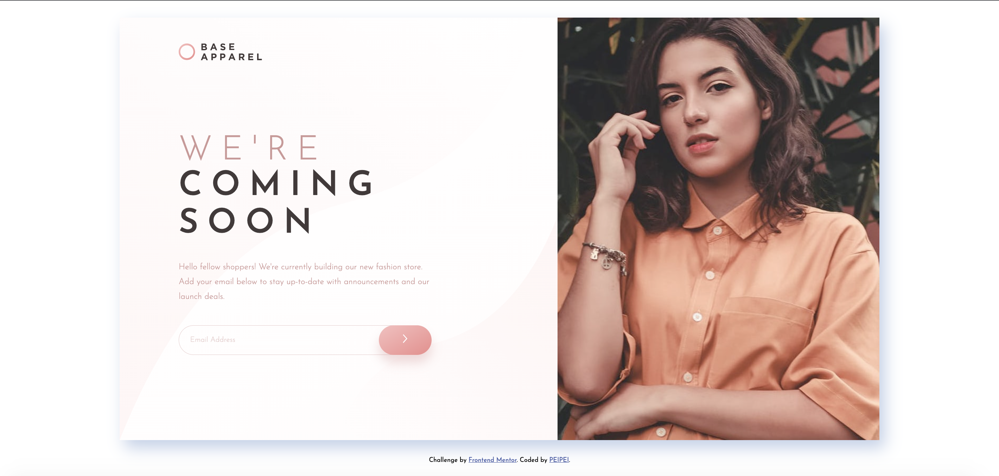

# Base Apparel Coming Soon

This project is a responsive website, with optimal layout for mobile and desktop, and come with basic form validation. Built with HTML, CSS and Javascript.

## Table of contents

- [Overview](#overview)
  - [The challenge](#the-challenge)
  - [Screenshot](#screenshot)
- [My process](#my-process)
  - [Built with](#built-with)
  - [What I learned](#what-i-learned)
  - [Continued development](#continued-development)
  - [Useful resources](#useful-resources)
- [Acknowledgments](#acknowledgments)

## Overview

### The function

Users are able to:

- View the optimal layout for the site depending on their device's screen size
- See hover states for all interactive elements on the page
- Receive an error message when the `form` is submitted if:
  - The `input` field is empty
  - The email address is not formatted correctly

### Screenshot



Desktop Layout


Desktop - Error State

## My process

### Built with

- Semantic HTML5 markup
- CSS custom properties
- Flexbox
- Mobile-first workflow

### What I learned

- Button Hover Effect in Desktop Layout

According to the design, the button has to have two layers of background-color, one with pink-hue linear-gradient, the other white with 50% opacity.

The white layer isn't visible until users mouse over the button.

In this solution, I used the '::before' selector, position and z-index, to put a exact same shape of element *above* the original button element(with linear-gradient background color).

```html
        <form id="email-form">
          <input type="email" name="email" placeholder="Email Address" required>
          
          <button type="submit">
            
          </button>
        </form>
```
```css
  button {
    position: relative;
    width: 100px;
    height: 56px;
  }

  /* Desktop UI: button hover effect */
  button::before {
    content: " ";
    position: absolute;
    top: 0;
    left: 0;
    width: 100%;
    height: 100%;
    background-color: rgba(255, 255, 255, 0.5);
    border-radius: 28px;
    z-index: 2;
    opacity: 0;
    transition: opacity 0.3s;
    box-shadow: 0px 15px 20px rgb(198, 110, 110, 0.2476);
  }

  /* Use opacity to control the visibility of white layer */
  button:hover::before {
    opacity: 1;
  }
```

- Image Background with Linear-gradient Overlay

For the background image of Desktop UI, I learnt that one could create linear-gradient overlay on image.

```css
  .container {
    flex-direction: row-reverse;
    height: 800px;
    max-width: 1440px;
    margin: 2em auto;
    background-image: linear-gradient(to right bottom, rgba(255, 255, 255, 0.5), rgba(255, 244, 244, 0.3)), url('../images/bg-pattern-desktop.svg');
    background-size: contain;
  }
```

However, compared to the design file, the result still looks a bit off. I'm still looking for a better way to solve this problem.

- EventListener: Use Blur Instead of Click for Better UX

For input validation, I used 'blur' for the first time for the form submitting process. In this way, users won't receive error warning until they finish editing.

```js
  //Validation happens when users are blurred out of form (when users finish edit) 
  input.addEventListener('blur', (event) => {
    event.preventDefault()
    checkInvalidStyle()
  })

  //Validation happens when users click the submit button
  button.addEventListener('click', (event) => {
    event.preventDefault()
   checkInvalidStyle()
  })
```

- event.preventDefault(): Disable Browser Default Pop-up Message

Browsers come with default pop-up messages that will conflict with the custom styling. Use event.preventDefault() to disable them.

### Continued development

This project took me longer than I expected, and I learnt a lot from the details!

Needless to say, this solution still has a lot of room for improvement.

- Javascript (app.js): could write with more simplicity.

- CSS (style.css): for the Mobile UI, the layout lost its form when device width is smaller than 375px.

- CSS (style.css): for the Desktop UI, the background image doesn't 100% match the design file.

- CSS (style.css)/ HTML (index.html): for the arrow.svg, I couldn't find a way to change its thickness to 2px as design file suggested, and unable to make it horizontally and vertically center in the button.

Any feedback or advice is highly welcomed.

### Useful resources

- [HTML5 Form Validation With the “pattern” Attribute](https://webdesign.tutsplus.com/html5-form-validation-with-the-pattern-attribute--cms-25145t) - This help me disable the browser's default popup message.
- [Form Validation: You want :not(:focus):invalid, not :invalid](https://www.bram.us/2021/01/28/form-validation-you-want-notfocusinvalid-not-invalid/) - This blog introduce why using 'blur' instead of 'click' is a good idea.
- [HTML Form: Mozilla.org](https://developer.mozilla.org/zh-TW/docs/Learn/Forms/How_to_structure_a_web_form)
- [ChatGPT](https://openai.com) - Gave me great advice on how to do the button hover effect.

## Acknowledgments

### Frontend Mentor - Base Apparel coming soon page solution

This is a solution to the [Base Apparel coming soon page challenge on Frontend Mentor](https://www.frontendmentor.io/challenges/base-apparel-coming-soon-page-5d46b47f8db8a7063f9331a0). 
